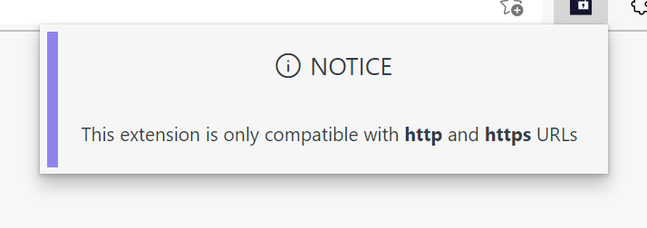
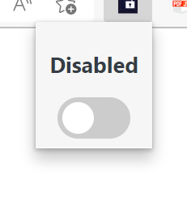
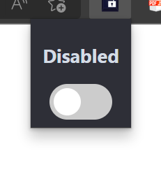
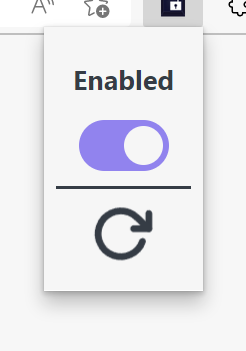
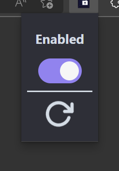

# web-input-unlocked
A browser extension that re-enables read only and disabled text and password inputs on the majority of websites.

### Logo

*Logo designed by [EAZ Creative LLC](https://www.eazcreative.com/)*

### UI

